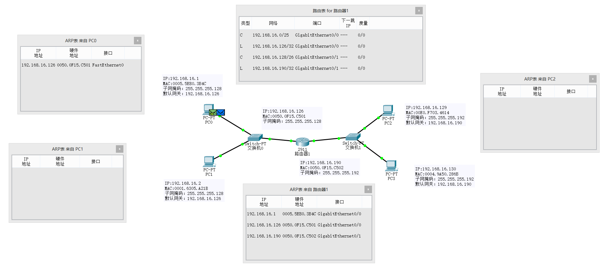

 

PC0 -----> PC2 通信过程如下：
1. PC0:根据目的IP地址查询路由表（将目的IP地址与本机子网掩码相与，若和本机IP地址与本机子网掩码相与 结果相同，则是处于同一网络中，**直接交付**），发现目的主机不在该网络中，主机PC0将通过**默认网关**发送给路由器；
2. PC0:将IP数据报封装成帧，由于刚开始PC0的ARP表为空，所以需先通过**广播的方式**发送ARP请求报文（ARP报文目的IP地址是默认网关）；
3. 路由器：交换机MAC地址表存储 PC0的MAC地址与端口映射关系；路由器接收到ARP请求报文，并通过**单播的形式**返回 ARP响应报文（包含自身的MAC地址）；
4. PC0: 主机更新自身的ARP表，然后将ICMP报文添加IP首部再封装成帧，转发至