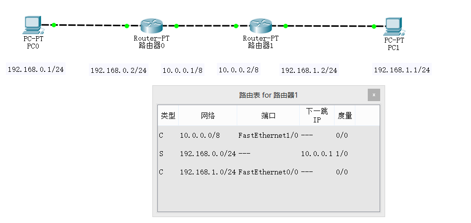
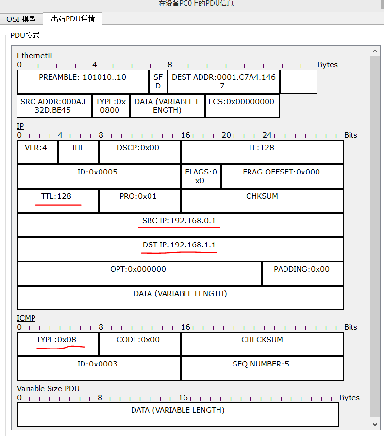
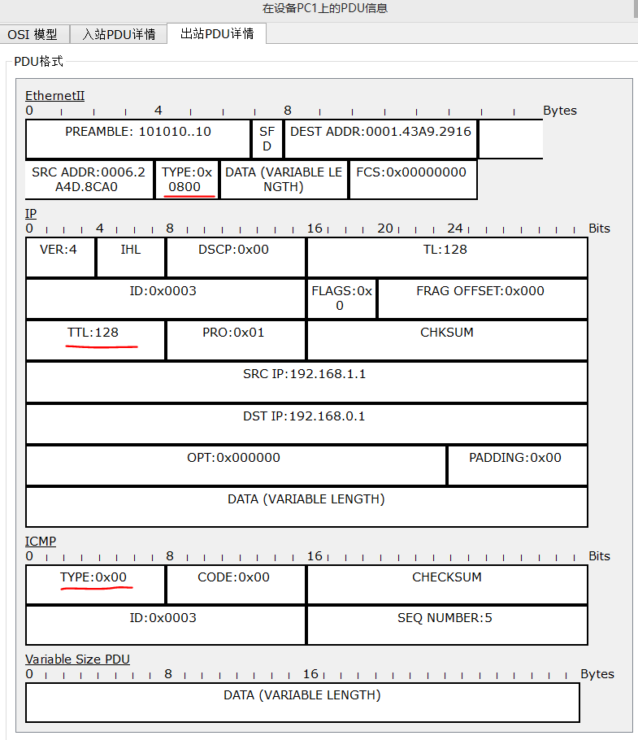
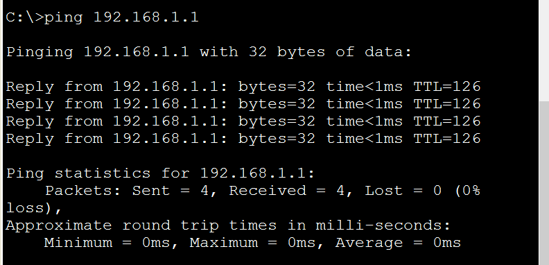

## ping程序
**ping进程主要用于描述 到目标主机 网络是否通畅。**

 

通过命令单步仿真ICMP报文传输过程：
1. 主机PC0发送ICMP请求报文，输出格式如下：
1.1  PING进程开始下一个PING请求。
1.2  PING进程创建了一个ICMP“回送请求”报文并将其传递给下层进程。
1.3  源IP地址未指定。设备将其设置为该端口的IP地址。
1.4  目的IP地址与源IP地址不在同一子网，并且不是一个广播地址。
1.5  默认网关已设置。设备设置下一跳为默认网关。

 

2. PC1接收到ICMP请求报文后，需要回传一个ICMP响应报文
2.1 ICMP进程通过将ICMP类型字段设置为“回送回答”以响应“回送请求”报文。
2.2 ICMP进程发送了一个“回送回答”响应报文。
2.3 目的IP地址与源IP地址不在同一子网，并且不是一个广播地址。
2.4 默认网关已设置。设备设置下一跳为默认网关。

 

ping进程一般会进行连续四次的探测，命令结果如下：

 

## tracert程序
