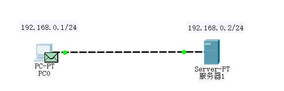

 

## TCP三次握手
**第一次握手：**
PC0输出：
1. 设备尝试创建一个到(192.168.0.2, 端口80)的TCP连接。
2. 设备设置连接状态为**SYN_SENT**。
3. TCP可接受的最大窗口值为65535字节。
4. TCP添加“最大报文段容量MSS”选项到TCP SYN的首部，其值等于1460字节。
5. 设备发送一个**TCP SYN**报文段。
6. Sent 报文段信息： 序号 0（随机值，下同），ACK号 0，数据长度 24。

**第二次握手：**
服务器输入：
1. 设备在服务器端口80上接收到一个TCP SYN报文段。
2. Received 报文段信息： 序号 0，ACK号 0，数据长度 24。
3. TCP从TCP报文段首部中的最大报文段选项中获取到的MSS值为1460字节。
4. 连接请求被接受。
5. 设备设置连接状态为**SYN_RECEIVED**。

服务器输出：
1. TCP可接受的最大窗口值为16384字节。
2. TCP添加“最大报文段容量MSS”选项到TCP SYN-ACK的首部，其值等于536字节。
3. 设备发送一个TCP **SYN+ACK**报文段。
4. Sent 报文段信息： 序号 0，ACK号 1，数据长度 24。

**第三次握手：**

PC0输入：
1. 设备在与(IP地址192.168.0.2, 端口80)的连接上接收到一个TCP SYN+ACK报文段。
2. Received 报文段信息： 序号 0，ACK号 1，数据长度 24。
3. TCP报文段具有所期望的对等序号。
4. TCP连接成功。
5. TCP从TCP报文段首部中的最大报文段选项中获取到的MSS值为536字节。
6. 设备设置连接状态为**ESTABLISHED**。

PC0输出：
1. 设备发送一个TCP ACK报文段。
2. Sent 报文段信息： 序号 1，ACK号 1，数据长度 20。

服务器输入：
1. 设备在与(IP地址192.168.0.1, 端口1025)的连接上接收到一个TCP ACK报文段。
2. Received 报文段信息： 序号 1，ACK号 1，数据长度 20。
3. TCP报文段具有所期望的对等序号。
4. TCP连接成功。
5. 设备设置连接状态为**ESTABLISHED**。

## TCP四次挥手
**第一次挥手：**

PC0输出：
1. 设备关闭了与(IP地址192.168.0.2, 端口80)的TCP连接。
2. 设备设置连接状态为**FIN_WAIT_1**。
3. 设备发送一个**TCP FIN+ACK**报文段。
4. Sent 报文段信息： 序号 101，ACK号 472（数据包长度为471），数据长度 20。

**第二次挥手：**

服务器输入：
1. 设备在与(IP地址192.168.0.1, 端口1025)的连接上接收到一个TCP FIN+ACK报文段。
2. Received 报文段信息： 序号 101，ACK号 472，数据长度 20。
3. TCP报文段具有所期望的对等序号。
4. TCP连接被断开。
5. 设备设置连接状态为CLOSE_WAIT。

第三次挥手：

6.设备数据传输设置连接状态为LAST_ACK。
7. TCP报文段具有所期望的ACK号。设备将缓冲区中最后一个被发送的报文段弹出。

