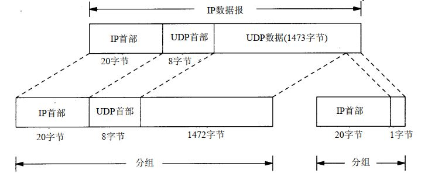

## UDP:用户数据报协议
UDP是一个简单的面向数据报的运输层协议，是一种[无连接](./#无连接)、**不可靠**的传输协议。UDP报文格式如下：

 

UDP首部共八个字节，字段主要含义如下：
|字段|含义|
|-|-|
|源端口号|可表示发送端进程|
|目的端口号|可表示接收端进程|
|UDP长度|UDP首部和数据部分总的长度|
|UDP校验和|覆盖了首部和数据部分的校验和，防止端到端通信数据改动|

:pencil:   注意点：
1. TCP和UDP的校验和包括了首部和数据部分，IP只校验首部；
2. 若校验出现差错，UDP数据报就要被悄悄地丢弃。不产生任何差错报。

## IP分片
任何时候IP层接收到一份要发送的 IP数据报时，它要判断向本地哪个接口发送数据（选路），并查询该接口获得其 MTU。IP把MTU与数据报长度进行比较，如果需要则进行分片。分片可以发生在原始发送端主机上，也可以发生在中间路由器上。  
把一份 IP数据报分片以后，只有到达目的地才由目的端IP层重新组装。  
以传输1501个字节IP数据包为例，说明IP分片的过程：

 

1. 将IP数据报首部中标识字段某比特位置1，表示“更多的片”；
2. 出口MTU为1500个字节，因此IP数据报分为两组。每一组都有自己的IP首部，并且每个片的总长度为该片的长度置值，路由的路径也不一定相同。IP首部中偏移字段表示偏移原始数据报开始处的位置，也就是分片的位置。本例分为两片，长度拆分为1500个字节，1个字节；
3. 目的主机接收到IP分片时，会在IP层重新组合。

:pencil:   注意点：
1. 在分片时，除最后一片外，其他每一片中的数据部分（除 IP首部外的其余部分）必须是 8字节的整数倍。
2. 当路由器收到一份需要分片的数据报，而在 IP首部又设置了不分片（ DF）的标志比特，会发出ICMP不可达差错报文。

## 广播与多播
广播和多播仅应用于**UDP**，可将报文同时传往多个接收者。

### 广播
一个主机向网上**所有**其他的主机发送数据帧，称为**广播**。
以太网广播地址全设置为1，也就是ff:ff:ff:ff
### 多播
多播处于单播和广播之间，数据帧仅传送至属于多播组的多个主机。
对于以太网，当地址中最高字节的最低位设置为 1时表示该地址是一个多播地址，用十六进制可表示为 01:00:00:00:00:00

## :bulb:    疑难点
#### :one:  面向连接和无连接
- 面向连接：就是通信双方在通信时，要事先建立一条通信线路，然后进行通信。其过程分为三个阶段。第一阶段是建立连接。第二阶段是连接成功建立之后，进行数据传输。第三阶段是在数据传输完毕后，释放连接。
- 无连接：无连接是指通信双方不需要事先建立通信线路，而是把每个带有目的地址的包（报文分组）发送到线路上，由系统选定路线进行传输，不需要目标方进行回复。