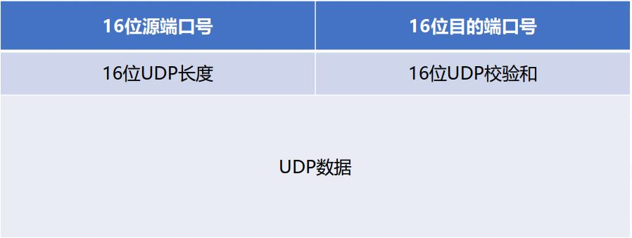

## UDP:用户数据报协议
UDP是一个简单的面向数据报的运输层协议，是一种[无连接](./#无连接)、**不可靠**的传输协议。UDP报文格式如下：

 

## :bulb:    疑难点
#### :one:  面向连接和无连接
- 面向连接：就是通信双方在通信时，要事先建立一条通信线路，然后进行通信。其过程分为三个阶段。第一阶段是建立连接。第二阶段是连接成功建立之后，进行数据传输。第三阶段是在数据传输完毕后，释放连接。
- 无连接：无连接是指通信双方不需要事先建立通信线路，而是把每个带有目的地址的包（报文分组）发送到线路上，由系统选定路线进行传输，不需要目标方进行回复。