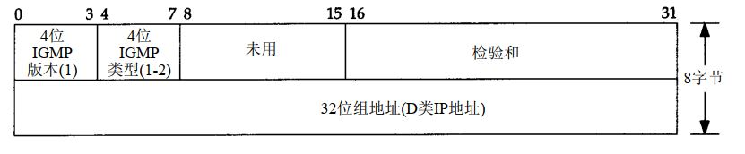

## IGMP:Internet组管理协议
IGMP协议支持主机和路由器进行多播，让一个物理网络上的所有系统知道主机当前所在的**多播组**，从而决定向哪个接口发送数据。
IGMP也被当作IP层的一部分，通过IP数据进行传输，报文有固定的长度，没有可选数据，格式主要如下：

 

其中，`类型`字段为1，表示是由多播路由器发出的查询报文；为2，表示是主机发出的报告报文。

### IGMP报告和查询
多播路由器使用 IGMP报文来记录与该路由器相连网络中组成员的变化情况，过程如下：
1. 主机的第一个进程加入组时，主机就会发送一个IGMP报文。如果有多个进程加入该组，只发送一个IGMP报文。该报文发送到进程加入组所在的同一接口上。
2. 进程离开一个组时，主机不发送 IGMP报告，即便是组中的最后一个进程离开。主机知道在确定的组中已不再有组成员后，在随后收到的 IGMP查询中就不再发送报告报文。
3. 多播路由器定时发送 **IGMP查询**来了解是否还有任何主机包含有属于多播组的进程。因为路由器希望主机对它加入的每个多播组均发回一个报告，因此 IGMP查询报文中的组地址被设置为0。
4. 主机通过发送 IGMP报告来响应一个 IGMP查询，对每个至少还包含一个进程的组均要发回IGMP报告。

使用这些查询和报告报文，多播路由器对每个接口保持一个表，表中记录接口上至少还包含一个主机的多播组。当路由器收到要转发的多播数据报时，它只将该数据报转发到（使用相应的多播链路层地址）还拥有属于那个组主机的接口上。

:pencil:   注意点：
- 当一个主机发送IGMO报告时，并不能保证报文被可靠接收。因此，会间隔一段时间重新发送。
- 当主机接收到IGMP查询报文时，并不立即响应，而是经过一定时间间隔后发出**一些响应**（对它参加的每个组均发出报告）。
