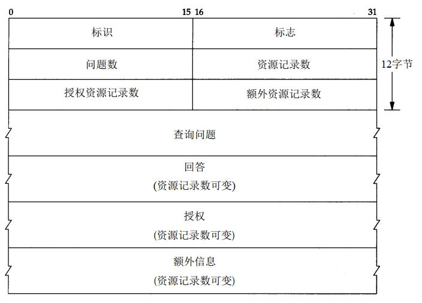
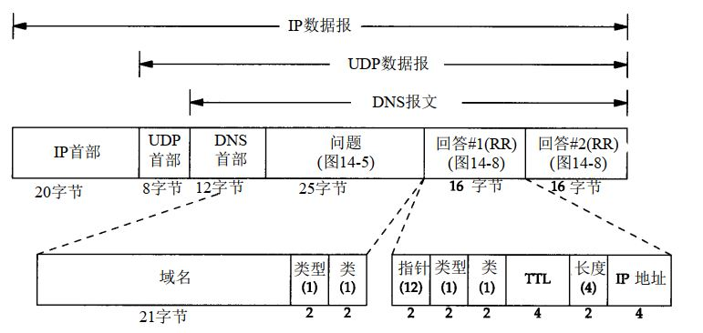

## DNS:域名系统
DNS是一种用于TCP/IP应用程序的分布式数据库，提供主机名字和IP地址之间的转换功能。在一个应用程序请求建立TCP连接或UDP发送数据报之前，必须将主机名转换为一个IP地址。对DNS的访问是通过地址解析器完成，主要通过两个库函数访问:
- gethostbyname(3):接收到主机名字返回IP地址；
- gethostbyaddr(3):接收IP地址返回主机名字。

## DNS报文格式
报文由12个字节长的首部和4个长度可变的字段组成。

其中：
- 标识字段： 由客户程序设置并由服务器返回结果。客户程序通过该字段确定响应与查询是否匹配。
- 标志字段： 包含若干子字段。表示了查询/响应报文，“授权回答”等。
- 数据段：4个字节，表示各自的条目数。

## DNS数据报封装

