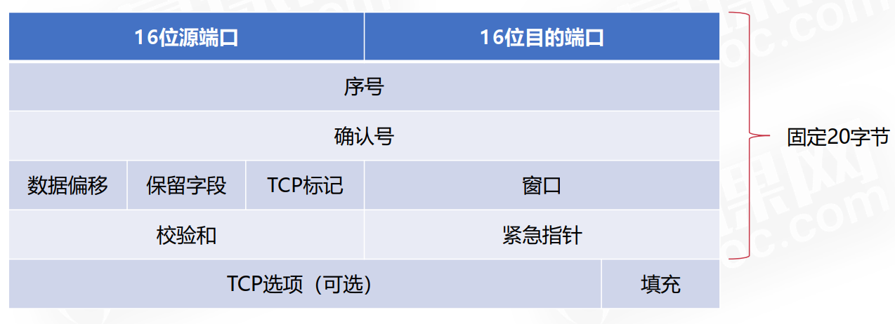
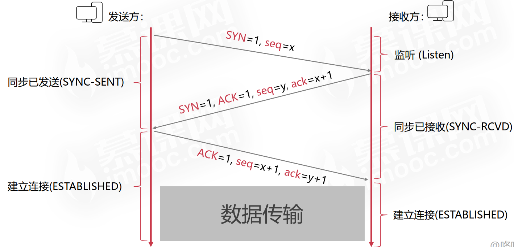
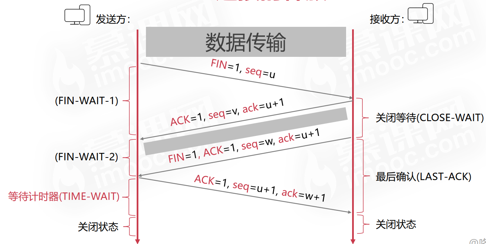

## TCP:传输控制协议
TCP是一种传输层协议，提供一种面向连接的、可靠的字节流服务。**面向连接**指的是使用TCP的应用程序在通信之前必须建立一个TCP连接；**字节流服务**指的是不在字节流中插入记录标识符；**可靠性**主要体现在以下几个方面：
- 应用数据被分割成TCP认为最适合发送的数据块；
- TCP拥有一个定时器，当规定时间未接收到报文或应答信号时，重新发送原数据报文；
- 接收方必须回复应答信号；
- TCP接收端会首先校验首部和，无误再接受；
- TCP会对接收到的数据重新排序，保证数据的正确顺序；
- TCP的接收端会丢弃重复的数据（每个数据都有编号可识别）；
- TCP的流量控制。

## TCP的首部
TCP首部固定部分20字节，允许范围20~60字节

每个字段的含义如下：
|字段|含义|
|-|-|
|源端口|用于寻找发端应用进程|
|目的端口|用于寻找收端应用进程|
|序号|占4个字节，用来标识发送的数据字节流，表示在这个报文段中的的第一个数据字节|  
|确认序号|一个字节占一个数据，表示期望收到数据的首字节序号|
|数据便宜|数据偏离首部的距离|
|TCP标记|占6位，包含ACK、SYN、FIN等|
|窗口|指明允许对方发送的数据量，用于流量控制|
|校验和|覆盖了TCP首部和数据部分|
|紧急指针|指定紧急数据在报文的位置|
|TCP选项|最多40字节，支持未来的扩展|

## TCP建立连接

 

TCP建立连接需要三次握手，具体过程如下：
:one:  客户端向服务器发送 SYN 报文（SEQ=x，SYN=1），并进入 SYN_SENT 状态，等待服务器确认；

:two:  第 2 次握手实际上是分两部分来完成的，即 SYN+ACK（请求和确认）报文。
  - 服务器收到了客户端的请求，向客户端回复一个确认信息（ACK=x+1）;
  - 服务器再向客户端发送一个 SYN 包（SEQ=y）建立连接的请求，此时服务器进入 SYN_RECV 状态。

:three:  客户端收到服务器的回复（SYN+ACK 报文）。此时，客户端也要向服务器发送确认包（ACK）。此包发送完毕客户端和服务器进入 ESTABLISHED 状态。

## TCP的四次挥手

   

TCP断开连接需要四次挥手，具体过程如下：
:one:  客户端向服务器端发送断开 TCP 连接请求的[FIN，ACK] 报文，在报文中随机生成一个序列号SEQ=u，表示要断开 TCP 连接；

:two： 当服务器端收到客户端发来的断开 TCP 连接的请求后，回复发送 ACK 报文，表示已经收到断开请求。回复时，随机生成一个序列号 SEQ=v。由于回复的是客户端发来的请求，所以在客户端请求序列号 SEQ=u的基础上加 1，得到 ACK=u+1;

:three: 服务器端在回复完客户端的 TCP 断开请求后，不会马上进行 TCP 连接的断开。确认数据传输完毕后才进行断开，向客户端发送 [FIN，ACK] 报文，设置FIN为 1。再次随机生成一个序列号 SEQ=w。由于还是对客户端发来的 TCP 断开请求序列号 SEQ=u 进行回复，因此 ACK 依然为 u+1；

:four: 客户端收到服务器发来的 TCP 断开连接数据包后将进行回复，表示收到断开 TCP 连接数据包。向服务器发送 ACK 报文，生成一个序列号 SEQ=u+1。由于回复的是服务器，所以 ACK 字段的值在服务器发来断开 TCP 连接请求序列号 SEQ=w 的基础上加 1，得到 ACK=w+1。

## :bulb:    疑难点
### 1. 为什么TCP连接需要建立三次握手，而不是两次？
若建立连接只需两次握手，客户端并没有太大的变化，仍然需要获得服务端的应答后才进入ESTABLISHED状态，而服务端在收到连接请求后就进入ESTABLISHED状态。此时如果网络拥塞，客户端发送的连接请求迟迟到不了服务端，客户端便超时重发请求，如果服务端正确接收并确认应答，双方便开始通信，通信结束后释放连接。此时，如果那个失效的连接请求抵达了服务端，由于只有两次握手，服务端收到请求就会进入ESTABLISHED状态，等待发送数据或主动发送数据。但此时的客户端早已进入CLOSED状态，服务端将会一直等待下去，这样浪费服务端连接资源。

### 2. 为什么断开连接是需要等待2MSL ?

