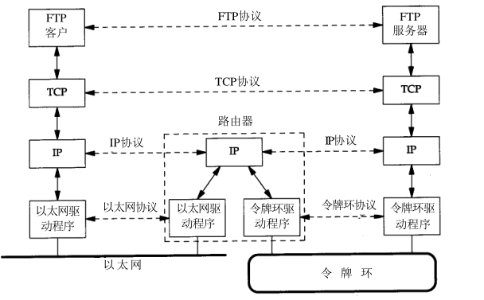
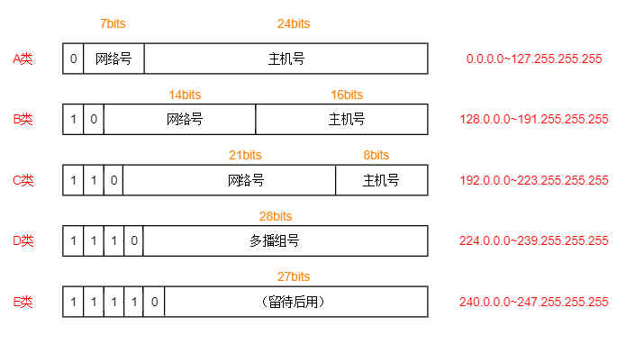

# TCP/IP协议族分层
|层次|包含协议|功能|
|-|-|-|
|应用层|Telnet、FTP、SMTP|处理特定的应用程序细节|
|传输层|TCP、UDP|为两台主机上的应用程序提供端到端的通信|
|网络层|IP、ICMP、IGMP|网络拓扑连接，确定两台主机的通信路径|
|链路层|以太网协议、[ARP、RARP]|包含设备驱动程序和计算机中对应的网络接口卡|

构造互联网主要是将两个或多个网络通过`路由器`进行连接，每个路由器上可连接相同网段下的多个主机。下图是通过路由器连接不同的网络：  

## IP地址 
ip地址长度为32bit，是每个接口唯一的网络标识，其基本结构如下图所示：

- 每个接口对应一个唯一的ip地址
- ip地址范围主机号和网络号，网络号由InterNIC（互联网络信息中心）分配，其位数主机号由用户分配
- ip地址还可分为：单播地址（目的为单个主机），广播地址（**给定网络**上的所有主机），多播地址（**同一组内**的所有主机）
- 通过DNS（域名系统）可以获得`IP地址`与`主机名`之间的映射关系

## 客户-服务端模型
客户端与服务器端通信时，可分为以下两种服务：  
  **重复型服务**：  
1. 等待一个客户请求
2. 处理客户请求
3. 发送响应至客户端
4. 返回步骤1

**并发型服务**：
1. 等待一个客户请求
2. 启动一个新的服务（子进程或线程）处理这个客户请求；处理结束后，终止这个新的服务
3. 返回步骤1

## 端口号port
TCP和UDP使用 16 bit的端口识别**应用程序**，一个主机/IP地址上可以有1~65535个端口。客户端和服务器端通信时，可以根据端口号（PORT）提供不同的网络服务（如FTP、Web），常用的端口如下：
- 1-1023：系统端口/公认端口，这些端口已明确表示了某种服务（如80端口为HTTP服务）
- 1024-5000：临时端口，从预设范围自动获取端口，一般提供给客户端
- 5001-65535：服务器端口/预留端口，用于用户自定义端口

## 疑难点
### 1. 端到端通信与点到点区别
传输层（TCP/UDP）是端到端（end to end）之间的通信。网络要通信，不管有多远，中间有多少机器，都必须在两头（源和目的）间建立连接，一旦连接建立起来，就已经是端到端连接，即端到端是**逻辑链路**，这条路可能经过了很复杂的物理路线，但两端主机不管，只认为是有两端的连接，而且一旦通信完成，这个连接就会释放，物理线路可能又被别的应用用来建立连接。**不关心路径，只在乎目标**

网络层（IP）是点到点（point to point）之间的通信，包含具体的**传输路径**。指的是发送端把数据传给与它直接相连的设备，这台设备在合适的时候又把数据传给与之直接相连的下一台设备，通过一台一台直接相连的设备，把数据传到接收端。例如数据从A传送到E，中间可能经过A->B->C->D->E，每个过程都是一个点，而网络层就是`路由`的过程     
———————————————————————  
**总之，端到端建立在点到点的基础上，端到端负责向目标主机传输数据，具体的数据传输过程由点到点负责**  

