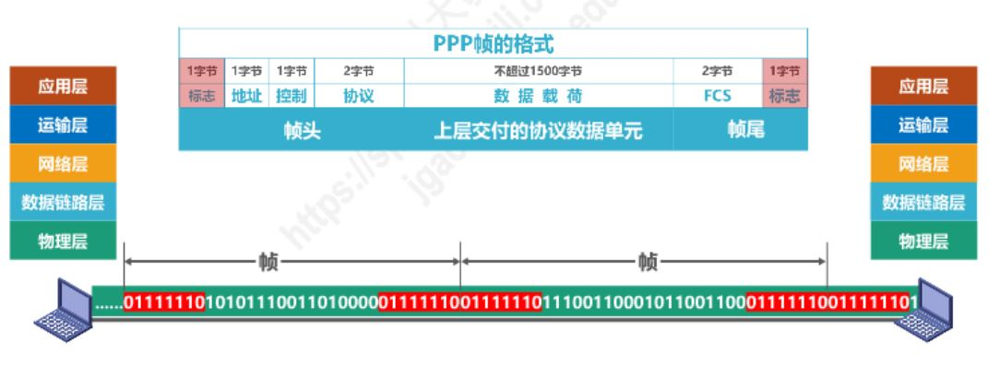
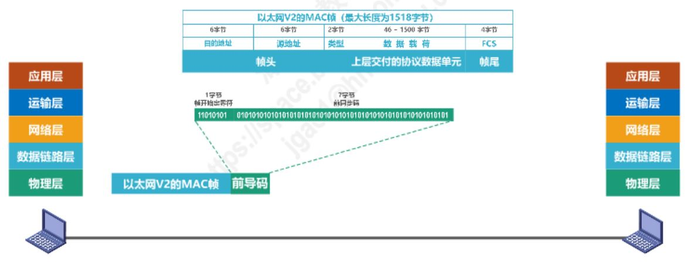
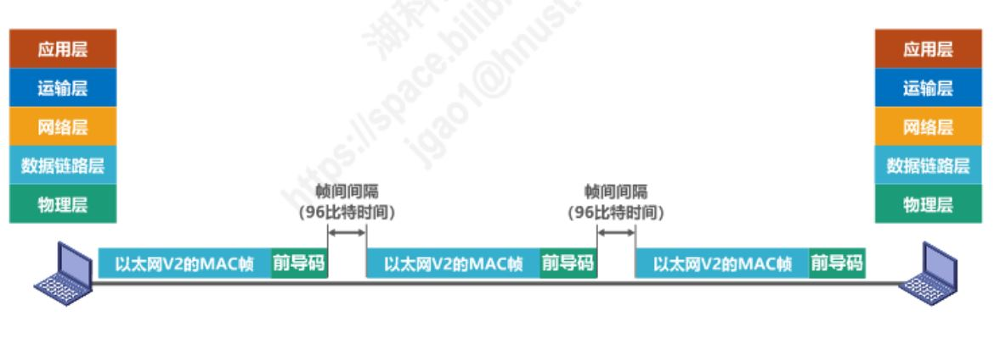

## 封装成帧
封装成帧是指数据链路层将上层交付的协议数据单元添加帧头和帧尾使之成为帧。帧头和帧尾中包含有重要的控制信息。

:question:  接收方的数据链路层任何从物理层交付的比特流中提取中一个个帧

帧头和帧尾的作用之一就是 **帧定界**：
#### PPP帧定界
链路层PPP帧的头部和尾部均有一个字节的`标志`字段，作为帧的分界，如下图所示：

#### MAC帧定界
MAC帧头部有8个字节的`前导码`,其中1个字节为`帧开始定界符`字段，表示帧的头界限。并且，MAC地址帧有帧间间隔，所以接收方可以分辨出帧结束的位置。
链路层PPP帧的头部和尾部均有一个字节的`标志`字段，作为帧的分界，如下图所示：

## 