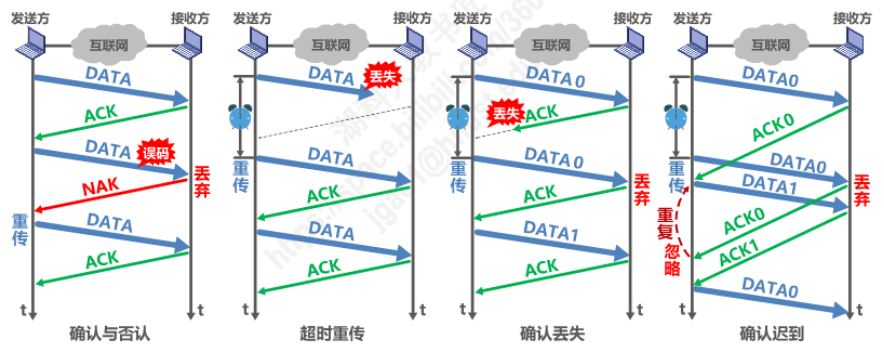
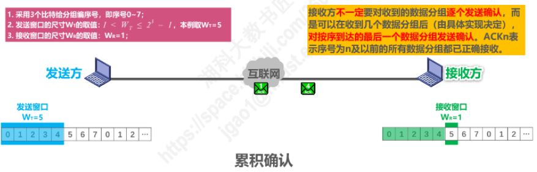
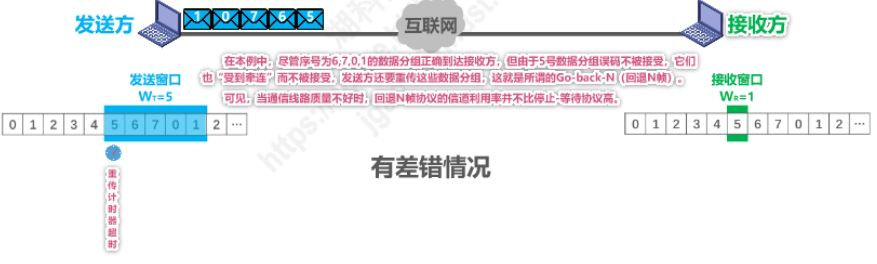

数据链路层向上层提供的服务类型主要有以下两类：
- **不可靠的传输服务**：仅仅丢弃有误码的帧，其他什么也不做；
- **可靠性的传输服务**：想办法实现 发送端发送什么，接收端就接收到什么。

一般情况下，有限链路的误码率比较低，为了减少开销，并不要求数据链路层向上提供可靠的传输服务。即使出现误码，可靠传输的问题由上层处理。
无线链路易受干扰，误码率比较高，因此要求链路层必须向上层提供可靠的传输服务。

## 可靠性传输服务
1. **比特差错**（1变为0，0变为1）只是传输差错的一种；
2. 从计算机网络体系结构来看，传输差错还包括**分组丢失**、**分组失序**以及**分组复用**；
3. *分组丢失**、**分组失序**以及**分组复用**这些传输差错，一般不会出现在链路层，而是出现在其上层；
4. 可靠性传输服务并**不局限于数据链路层**，其他各层均可实现可靠传输；
5. 可靠性传输服务比较复杂，开销较大；

可靠性传输实现机制主要有以下三种：  
**停止-等待协议SW**		**回退N帧协议GBN**		**选择重传协议SR**

### 停止等待协议SW
**停止等待协议**就是发送方每发送一个数据分组后就停止发送，等待对方的确认。再收到应答信号后，才继续发送发送下一个分组，是一种全双工的通信方式。
停止等待协议一般会出现下列四种情况：

1. 确认与否认：发送方发送完数据分组后，若校验正确，则回传一个应答ACK信号；若出现误码，则回传一个NAK信号。
2. 超时重传： 发送方发送完一个分组后，启动一个**超时定时器**。若到了超时定时器设置的重传时间，而发送方仍未接收到ACK或NAK信号，则chong'chuan 原来的数据分组。一般重传时间为略大于“从发送方到接收方的平均往返时间”；
3. 确认丢失：若确认型号ACK在传输过程中丢失，由于超时重传机制，发送方还会发送原来的数据分组，导致接收方受到**重复的分组**。为了让接收方能够判断接收的分组是否重复，需要给数据**分组编号**。若接收到重复的分组，则丢弃该数据分组，并发送一个ACK信号，要求获得下一个分组。
	- 由于停止-等待协议的特性，分组序号占一个比特，即编号0和1；
 	-  为了让发送方判断确认ACK分组是否重复，可以给ACK分组编号。
 4. 确认迟到：如果确认ACK0分组迟到，由于超时重传，会重新发送分组为0的数据分组。但迟到的ACK0分组此时到达发送方，发送方还会发送编号为1的数据分组；接收方收到重复的数据分组0会丢弃，但仍会发送ACK0分组以及ACK1信号。而发送方受到重复的ACK0也会丢弃，并继续传输下一个分组。

为了解决停止-等待协议信道利用率低的问题，引入了后退N帧协议和选择重传协议。

### 回退N帧协议
为了提高传输效率，当发送方等待确认时，必须传输多个分组。发送方有n个bite表示分组序号，可维持的窗口大小为 1 < Wt <= 2^-1, 接收方的窗口大小 Wr = 1。
 假设使用3个bit给分组标号，发送方窗口大小为Wt = 5，其工作过程如下：
1. 无差错情况：

也就是序号0-4的数据分组均被接收方接收，无误码情况。接收方不一定要对收到的数据分组**逐个发送确认**。而是在受到几个数据分组后，对排序到达的最后一个数据分组发送确认。ACKn表示序号为n以及之前的所有数据分组均以正确接收。此时，发送方会移动一个窗口的大小，发送下一组数据。

 2. 有差错情况：
 

发送的一个窗口大小的数据分组中出现误码，则接收方将出现误码的数据分组以及序号之后的数据分组丢弃，并依次回传NAK信号。也就是接收方必须接受到正确的窗口指向的序号分组，否则重传。

## :bulb:    疑难点
### 1. 为什么回退N帧协议发送方窗口大小要小于2^n-1 ?
以下列情况为例，若用3为bit表示分组序号，窗口大小为8，依次发送序号0-7的数据分组。若分组全部正确接收， 

