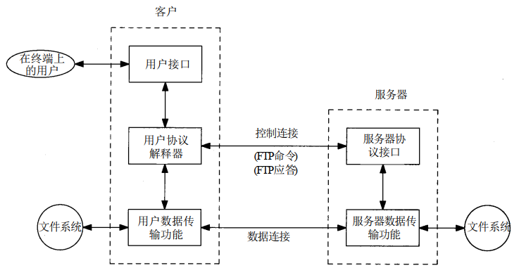

## FTP:文件传送协议
FTP:将某台计算机中的文件通过网络传送到可能相距很远的另一台计算机中，是一项基本的网络应用。

文件传送协议FTP是因特网上使用最广泛的文件传送协议。
- [ ] FTP提供**交互式访问**，允许客户指明文件的类型与格式（如指明是否使用ASCII码），并允许文件具有存取权限（如访问文件的用户必须经过授权，并输入有效的口令）。
- [ ] FTP屏蔽了各计算机系统的细节，因而适合于在异构网络中任意计算机之间传送文件。

## FTP的基本工作原理
FTP在工作过程中，**控制连接**与**数据连接**并行执行。

   

FTP有两种工作模式：**主动模式**、**被动模式**：

**主动模式：**
1. 建立控制连接：FTP客户端发起TCP连接（客户端随机选择临时端口号，服务器端使用熟知的端口号 **21**），用于传送控制命令。控制连接在整个会话期间一直保持打开，用于传送FTP相关控制命令；
2. 建立数据连接：FTP服务器端**主动发起**TCP连接（客户端使用另一个临时的端口号，服务器端使用熟知的端口号** 20**）。数据连接用于数据传输，在每次文件传输时才建立，传输结束就关闭。

**被动模式：**
1. 建立控制连接：FTP客户端发起TCP连接（客户端随机选择临时端口号，服务器端使用熟知的端口号 **21**），用于传送控制命令。控制连接在整个会话期间一直保持打开，用于传送FTP相关控制命令；
2. 建立数据连接：FTP服务器端**主动发起**TCP连接（客户端使用另一个临时的端口号，服务器端使用熟知的端口号** 20**）。数据连接用于数据传输，在每次文件传输时才建立，传输结束就关闭。

