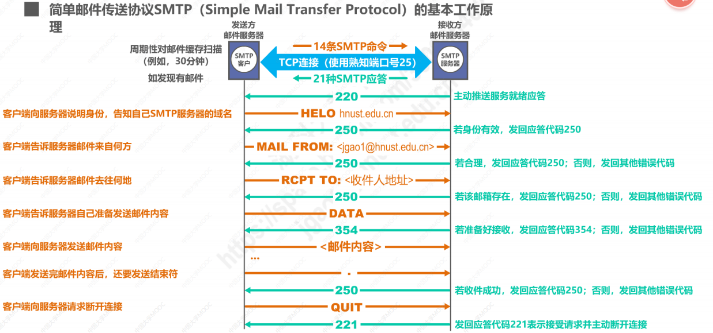

## 电子邮件
电子邮件的转发过程：
1. 发件人将邮件发送到自己使用的邮件服务器；
2. 发送人在**邮件服务器**将收到的邮件按其目的地址转发到收件人邮件服务器中的邮箱；
3. 收件人在方便的时候访问收件人邮件服务器中的邮箱，获取电子邮件。

**电子邮件系统**采用** 客户/服务器方式**，包括三个主要的组成构件：**用户代理**、**邮件服务器**以及**电子邮件所需的协议**：
- [ ] 用户代理 是用户与电子邮件系统的接口，又称为电子邮件客户端软件；
- [ ] 邮件服务器是电子邮件系统的基础设施，其功能是发送和接收邮件，同时还要负责维护用户的邮箱；
- [ ] 协议包括 邮件发送协议（例如SMTP）和邮件读取协议（例如POP3、IMAP）。其示意图如下：  

  

-  一封邮件有 **信封** 和 **内容** 两部分组成，而内容又由 **首部** 和 **主体** 两部分组成
- SMTP协议只能传送ASCII码文本数据，不能传送 可执行文件或其他的二进制对象；但通过邮件扩展 MIME （实现其他文件形式与ASCII码文本的相互转换）可实现其他形式文件的传送；

常用的邮件读取协议有以下两个：
- [ ] 邮局协议POP：用户只能以下载并删除方式或下载并保留方式从邮件服务器下载，**不允许**用户在邮件服务器上管理自己的邮件（如创建文件夹、邮件分类等）；**使用端口**为110；
- [ ] 因特网邮件访问协议IMAP：用户在自己的计算机上就可以操控 邮件服务器上的邮件，是一个联机协议。**使用端口**为143.

## SMTP基本原理

 

