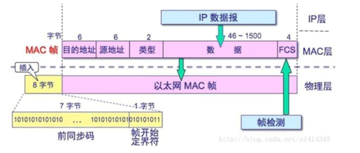
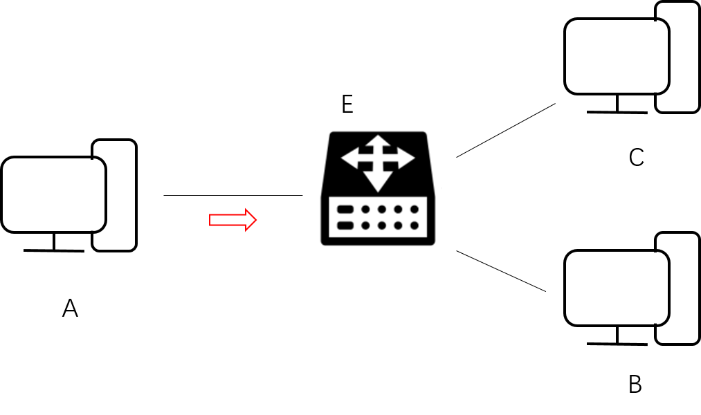
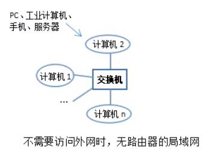
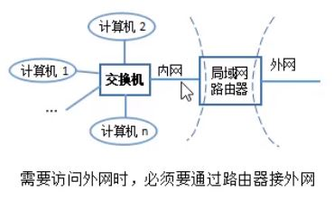

# 链路层
链路就是从一个节点到相邻节点的一段物理线路，中间没有任何其他的交换节点。
链路层主要有三个目的：  
1. 为IP模块发送和接收IP数据报
2. 为ARP模块发送ARP请求和接收ARP应答
3. 为RARP模块发送RARP请求和接收RARP应答

## 以太网
以太网协议是一种广泛应用的局域网技术，基于MAC地址的**广播方式**实现数据传输，只能在局域网内广播  
### 以太帧
**工作机制**  
当从网络层接收到数据报后，链路层（以太网协议）需要完成以下工作：  
1. 根据需要将网络层的数据分解成较小的块，以符合以太帧的要求（一般以太帧的大小为64~1518字节）；  
2. 将数据块打包成帧，包含数据及其他信息；
3. 将以太帧传递到物理层，后者将帧转换为比特流，通过传输介质发送出去；
4. 局域网内的其他网关/主机接收数据，检查目的MAC地址，若适配则接收并向上逐层解析；若不适配，重新路由至下一个网关，直到找到目标主机。

**以太帧的结构**  
以太网帧是将网络层（IP/ICMP...）的数据报添加帧头和帧尾进行封装

  

主要字段含义如下：  
|字段|含义|    
|-|-|    
|前同步码|接收到以太帧的主机/路由器会调整时钟频率，与发送端相同；原因是每个帧数据有相同的时间间隔（96bit时间），作为界限|      
|目的地址|下一跳接收端的物理MAC地址，为6个字节（48位）|  
|源地址|发送端的物理地址（MAC地址）|  
|类型|表示上层（网络层）使用的协议，占两个字节，如0X0800表示为IP协议、0X0806表示ARP协议|  
|数据|表示交付至上层的数据（如IP数据报），大小为46~1500 byte，不足会自动填充|  
|FCS|帧错误检测，占4个字节，可通过CRC校验|  

### 最大传输单元MTU  
  链路层允许的一次最大传输数据帧的长度，如以太帧要求数据部分的最大长度为1500个字节。当从网络层接收的数据报长度大于链路层的MTU时，就会拆分成若干片。
 
### 路径MTU  
当通信的两台主机需要经过多个网络时，每个网络的链路层有不同的MTU，其中最小的MTU称为路径MTU。  

## 以太网数据传输过程  
要求在`局域网`内完成**相邻设备**的数据帧传输   

  
 其中链路层包含以下的MAC地址表：  

|MAC地址|硬件接口|
|-|-|
|A|E1|
|B|E2|
|C|E3|  
  
传输过程：  
1. A通过网卡发送数据帧  
2. 数据帧到达路由器E，然后根据目的MAC地址查询 `MAC地址表`    
3. 如在MAC地址表找到匹配项，则通过单播的形式（一对一）向端口发送数据帧；若未找到表项，则E将通过广播的形式（一对多）将数据帧发送给局域网其他相连的端口（B,C），并接受来自它们的回应，更新MAC地址表。

## 疑难点  
### 1.交换机与MAC地址表  
交换机在osi模型中，工作在第二层（链路层），用于**扩展网路接口**，可以实现**局域网**内主机之间的通信。属于内网设备， 连接如下图所示：  
 

    

其工作原理是基于`MAC地址表`，它拥有MAC地址和硬件接口的映射关系，当一个主机试图与另外一个主机通信时，交换机就会查询`MAC地址表`，根据目的MAC地址将数据帧发送给对应端口的主机。  

### 2.路由器与路由表
- 路由器工作在osi模型第三层（网络层），**决定数据传输的路径**（路由功能），可以实现**不同网络**之间的通信。目前的路由器具有交换机的功能，只不过接口较少。
- 路由器有两个IP地址，充当内网设备时使用内网IP地址，充当外网设备时使用外网IP地址 
  

    
其工作原理是基于`路由表`，每个主机/路由器的路由表存储的是`目的IP地址`与`下一跳IP地址`映射关系。通过在网络层获得下一跳的IP地址再经过ARP协议转换获得目的MAC地址传至链路层。  
    
   ### 3.构建局域网的方式  
1. 当连接主机较多时（学校，企业），通过交换机构建，多个交换机可以相互连接，看成一个交换机
2. 连接主机较少时（家庭），通过路由器构建，路由器既有路由功能（负责与外网的通信），也有交换机功能，完成局域网下相邻设备间数据传输。   
  ### 4.当前网络连接中没有交换机，那么路由器会不会有MAC地址表？

路由器具有交换机功能，在一定程度可以替换交换机

