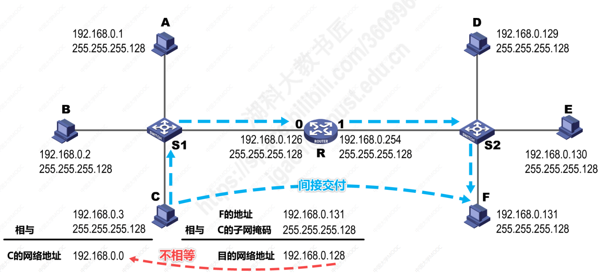
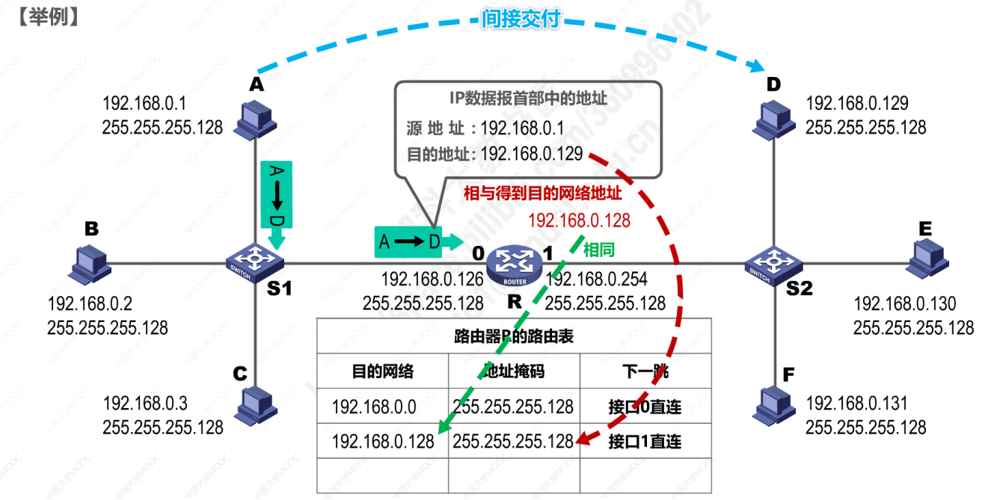

IP数据报的发送和转发过程包含以下两部分：
- [ ] 主机发送IP数据报
- [ ] 路由器转发IP数据报

## 主机发送IP数据报
 判断目的主机是否与自己处于同一网络中：
- 若在**同一个网络**，则属于**直接交付**；
- 若**不在同一网络**，则属于 **间接交付**，传输给主机所在网络的 **默认网关**（路由器），由默认网关帮忙转发。
 

  
  
如图所示：
主机A------>主机C：属于直接交付，查询交换机S1的MAC地址表可直接发送端口；  

主机C------>主机F：属于间接交付，将目的主机的IP地址与源主机的MAC地址相与。若等于源主机的网络地址，则源、目的主机处于同一网络中；否则，属于两个网络。主机C将IP数据报发送至 **默认网关**。

## 路由器转发IP数据报
转发过程：
1. 路由器检查IP数据报首部是否出错：若出错，则丢弃该数据报并发送ICMP差错报文；若没有出错，则进行转发。
2. 根据IP数据报的目的地址在路由表中查找匹配的条目：若找到匹配的条目，则转发指示的下一跳；若找不到，则丢弃该IP数据报并告知源主机。

 

 

主机A------>主机D:路由器将数据报中目的IP地址与路由表中各MAC地址相与，若存在 匹配网络，则按照 **“下一跳”**的指示转发。

:pencil: 注意点：
1. **路由器不会转发广播数据报**，隔离**广播域**和**冲突域**。

