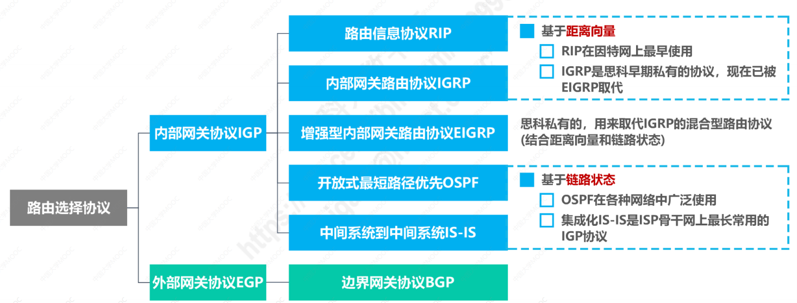

## 静态路由配置
- [ ] 静态路由配置是指用户或网络管理员使用路由器的相关命令给路由器 **人工配置**路由表
  - 这种人工配置方法方式简单、开销下。但不能及时适应网络状态（流量、拓扑等）的变化；
  - 适用于**小规模网络**中使用。
 - [ ] 使用静态路由配置可能会出现以下导致 产生 **路由环路** 的错误：
  - 配置错误
  - 聚合了不存在的网络
  - 网络故障  

 

  

 该例中，路由表中除了直连的网络，可以人工配置路由路径（静态配置）；  
通过添加目的网络为 0.0.0.0/0以及下一跳可设置默认路由，当目的网络不在当前的路由表条目中，或者下一跳连接的目标网络很多，可以默认从该接口转发；  
如果需要特定的主机通信，可具体设置特定主机的IP地址在路由表中。

## 动态路由选择
- [ ] 路由器通过路由选择协议自动获取路由信息；
- [ ] 比较复杂、开销较大，但能更好的适应网络状态的变化；
- [ ] 适用于大规模的网络

动态路由的特点：
1. 自适应： 动态路由选择，能较好的适应网络状态的变化；
2. 分布式： 路由器之间交换路由信息；
3. 分层次： 将整个因特网划分为许多较小的自治系统AS。

常见的路由选择协议如下图所示：
 

路由表的基本结构如下：

路由表主要包括路由选择处理、分组处理。路由选择处理是接收路由报文，更新路由表，选择合适的路由路径；分组处理是将数据分组转发。其中，路由器还包含了输入缓存区以及输出缓冲区。

### 路由信息协议RIP
RIP是基于**“距离向量D-V”**，使用 **跳数** 来衡量到达目的网络的距离。
- [ ] 路由器到直连网络的距离定义为1；
- [ ] 路由器到非直连网络的距离定义为所经过的路由器数加1；
- [ ] 允许一条路径最多只能包含15个路由器。**距离**等于16时相当于不可达。
所以，RIP只适用于小型网络。

工作原理：
- [x] RIP认为 “好的路由”就是“距离短”的路由，也就是通过路由器数量最少的路由；
- [x] 当到达同一目的网络有多条“距离相等”的路由时， 可以进行 **等价负载均衡**，也就是这多条路径均可转发；
- [x] RIP需要解决以下三个问题：
  - 和谁交换信息     仅和 相邻路由器交换信息；
  - 交换什么信息     自己的路由表；
  - 何时交换信息     周期性交换（例如每30秒）

基本工作过程：
1. 路由器刚开始工作时，各路由器中的路由表只存储了直连网络信息；
2. 路由器仅和 **相邻路由器**周期性地交换并更新路由信息；
3. 若干次交换和更新后，每个路由器都知道本AS内各网络的最短路径和下一跳地址， 称为**收敛**；

其中，路由条目更新规则如下：
1. 接收相邻路由器发送过来的封装有路由信息的RIP更新报文；
2. 将相邻路由器的路由表中的距离增加1，下一跳改为当前路由器地址；
3. 将改造后的路由表与本路由表对比，要求如下：
   - 具有相同的网络和 下一跳时， 按照改造后的路由表更新；
   - 改造后路由表相比有新的网络，增加；
   - 相同的目的网络，不同的下一跳，按路径最短更新；
   - 相同目的网络，不同下一跳，相同距离，添加，等价负载均衡。
   
初始RIP路由表： 

更新RIP路由表：

RIP存在“坏消息传播的慢”问题，又称路由环路。

### 开放最短路径优先OSPF
具有以下特点：
- 基于链路状态，不像RIP是基于距离向量；
- 采用SPF计算路由，从算法上不会产生路由环路
- OSPF不限制网络规模，更新效率高、收敛速度快；
- 链路状态是指相邻的路由器，以及相应的链路**“代价”**（费用、距离、时延等）；其中，思科路由器采用 100Mbps/链路带宽。计算结果小于1计为1且舍去小数。

工作原理：
- [ ] OSPF相邻路由器之间通过交互 问候（Hello）分组，建立和维护邻居关系；
    - Hello分组封装在IP数据报中，发往组播地址224.0.0.5
    - 发送周期为10s
    - 40s未收到来自邻居路由器的Hello分组，认为该邻居路由器不可达
- [ ] 每个路由器会产生链路状态通告LSA（包含直连网络的链路状态信息以及邻居路由器的链路状态信息），封装在链路状态更新分组中采用洪泛法发送；
- [ ] 每个路由器都有一个链路状态数据库LSDB，用于存储LSA.最终个路由器的LSDB达到一致

工作过程：

五种分组类型：
- [ ] 问候分组：用于发现和维护邻居路由器的可达性；
- [ ] 数据库描述分组：向邻居路由器给出自己的链路状态数据库中所有信息；
- [ ] 链路请求分组：向邻居路由器请求发送某些链路状态项目的详细信息；
- [ ] 链路状态更新分组：路由器使用这种分组将其链路状态洪泛发送，对全网更新链路状态；
- [ ] 链路状态确认分组：对链路状态更新分组的确认分组。

 
