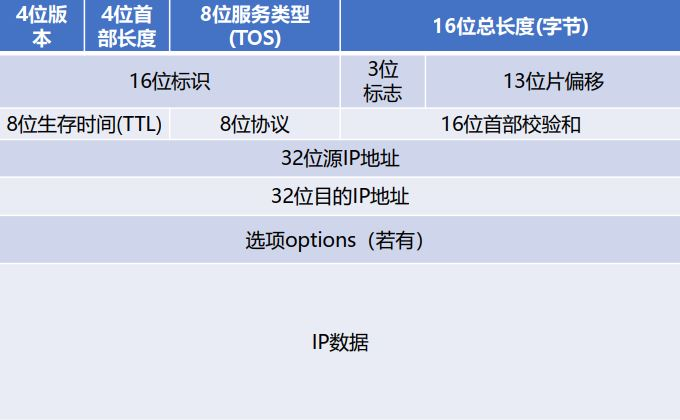

# IP:网际协议  
决定数据在网络中的传输路径  

### IP地址  
[IP地址组成说明](./chap1_overview.md/#IP地址)  
## 子网划分与子网掩码
**子网划分**：数据在网络传输过程中（路由），通过网络ID找到对应网络，通过主机ID找到对应主机。但当一个网络包含很多的主机时，根据主机ID查找比较困难。所以，可将主机ID部分进一步划分为`子网ID`和`主机ID`，子网ID用于寻找网络内的子网，主机ID用于寻找子网中的主机。  
**子网掩码**：因此，32bit的IP地址可以分为网络号、子网号以及主机号，其中子网掩码的目的是确定IP地址中有多少位的子网号，多少位的主机号。其中，**32bit**的子网掩码通过值1表示网络号和子网号，值0表示主机号。最后，再通过IP地址的类型，将主机ID的位数减去主机号的位数，即子网位数。如下图所示： 
 

  
  
通过子网掩码可以得知，网络号位数+子网号位数=24bit，**主机号位数** 8bit，又是B类IP地址，所以，网络号为16bit，则**子网号位数**为8bit  

## IP报文格式
IP数据报由**首部（报头）**和**数据**两部分组成，首部的固定部分为**20个字节**，是所有IP数据报必须具有的。[可选字段]长度可变。  
  

  
IP报头的最小长度为20个字节，每个字段的含义如下：

|字段|含义|
|-|-|
|版本|指IP协议的版本，通信双方版本必须一致，目前主要有IPv4、IPv6|
|首部长度|占4位，最大数值为15，单位是4个字节，表示IP首部长度，最大长度为60个字节|
|总长度|占16位，最大数值为65535，表示IP报文的总长度（首部+数据）|
|标识|每产生一个数据报，计数器就加1，并赋值给标识字段；当需要分片时（超出MTU），相同标识字段的报文之后会重组|
|标志|分片标志|
|片偏移|以8个字节为偏移单位，标记分片的位置|
|生存时间|报文在网络中的寿命，防止报文无限制的传播，浪费网络资源；每经过一个设备，TTL减1，为0时网络设备必须丢弃报文|
|协议|表示报文数据部分使用的协议，6表示TCP，17表示UDP，1表示ICMP|
|首部校验和|校验首部字段在传输过程是否发生改变|

## IP报文转发过程
- 若源主机A与目标主机B属于**同一网段**，则直接通过ARP协议将目标IP地址（B）转换为MAC地址，发送至B
- 若源主机A与目标主机B**不属于同一网段**，则报文传输过程（点对点，逐跳）如下：
  - 网关（路由器）E的IP地址被解析成MAC地址，源主机A将报文**传输至E**；
  - 网关根据数据包中的网络ID寻找目标网络。如果成功找到，则发送至目标网段，之后执行同一网段下的操作；若未找到，将数据包再发送至上一级网络（城域网、广域网、互联网），重复操作。
  - 发送至正确网关后，目标IP地址被解析成MAC地址，再通过MAC地址表发送至目标端口。

# 疑难点
## 1.局域网、网段
**网段：**  
- 通过一个交换机/路由器连接的主机属于同一网段；通过桥接的方式连接多个交换机，不同交换机下的主机属于不同网段；
- 判断是否处于同一网段：将IP地址与子网掩码与运算，若结果相同，则处于同一网段（一般B类IP地址前三个字节相同）

**局域网：** 
- 通过桥接的方式连接多个交换机，多个网段组成一个局域网（单个交换机也可）
## 2.不同局域网下为什么有相同的IP地址/网段
局域网内的IP为私有IP，一个局域网内的IP不可相同，但不同局域网内的IP没有限制。局域网设备（主机/路由器）经过**路由器**连接外网时，会进行[NAT](chap5_RARP-protocol.md/#NAT技术)技术（Network Address Translation，网络地址转换协议）转换，将私网IP地址转换为公网唯一的IP地址（在IP报文中修改）。所以，不同局域网下，相同IP地址的主机可以通信。

