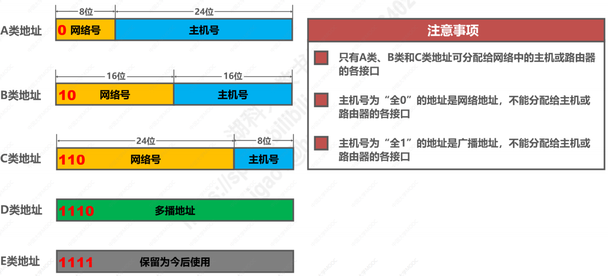

# IPv4地址
IPv4地址 是在因特网上的 **每一台主机**（或**路由器**）的**每一个接口**上分配的全世界范围内 **唯一的32比特**的标识符。

## 分类编址的IPv4地址
 

   

其中：
- A类地址网络号的范围：0. ~ 127. ,其中网络号0和127不能分配给主机或路由器接口，网络号0保留不指派，网络号127 是**本地环回测试地址**；
- B类地址网络号的范围： 128.0 ~ 191.255;
- C类地址网络号的范围： 192.0.0 ~ 223.255.255.
:pencil:   注意点：
- 主机号全为0， 即为该网络下的网络地址；
- 主机号全为1，即为该网络下的广播地址。

## 划分子网的IPv4地址
划分子网就是将IP地址中的主机号划分一部分作为子网网络号
划分子网的主要作用如下：
- 能够降低等待时间和花费费用；
- 减少其他路由器中路由表记录的数量；
- 能够节省原有网络中的大量IP地址。

32比特的**子网掩码**可以表明分类IP地址的主机号部分被借用了几个比特作为子网号。
- [] 子网掩码使用 连续的比特1来对应网络号和子网号；
- [] 子网掩码使用连续的比特0来对应主机号；
- [] 将划分的子网的IPv4地址与其相应的子网掩码进行逻辑与运算 即可得到该IPv4所在子网的网络地址。

## 无分类编址的IPv4地址
划分子网在一定程度上可以缓解IP地址紧缺的问题，但数量巨大的C类网因其地址空间小而没有充分利用。因此，可采用无分类编址的方式解决。
无分类域间路由选择 CIDR 消除了传统的A类、B类
