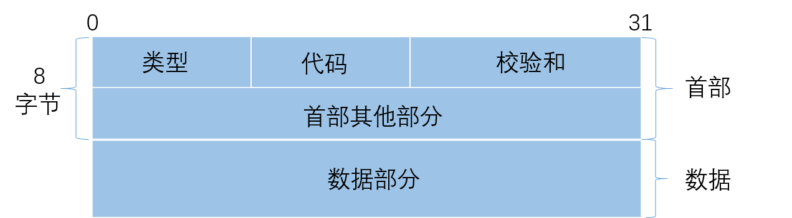
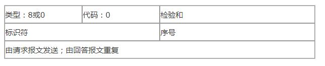
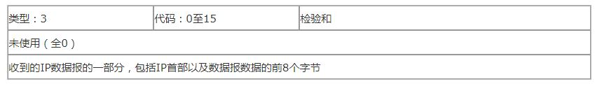

# ICMP协议：控制报文协议
由于 IP 协议简单，数据传输天然存在不可靠、无连接等特点，为了解决数据传输出现的问题，引入了ICMP协议。ICMP 协议用于在 IP 主机和路由器之间传递控制消息，描述网络是否通畅、主机是否可达、路由器是否可用等网络状态。它可以跟踪消息，把问题反馈给源主机。 
 
:bulb:  ICMP 协议的数据包并**不传输用户数据**，但是对于用户数据的传递起着重要的作用。

## ICMP报文格式
ICMP报文分为**差错报文**（不可达信息）、**查询报文**（请求、应答等）。报文格式如下：

  
每个字段含义如下： 
 
|字段|含义|
|-|-|
|类型|占1个字节，描述特定地ICMP报文|
|代码|占一个字节，和`类型`共同使用|
|校验和|占2个字节|
|数据部分|查询报文和差错报文有所不同|

ICMP查询报文，以请求/应答为例： 

ICMP差错报文，以目的不可达为例： 

产生差错的数据报IP首部 + 原始IP数据报中数据的前8字节

 

常见ICMP类型和代码对应表如下所示:
 
 
类型		代码		含义    
0		0		回显应答（ping 应答）    
3		0		网络不可达    
3		1		主机不可达    
3		2		协议不可达    
3		3		端口不可达    
3		4		需要进行分片，但设置不分片位    
3		5		源站选路失败     
3		6		目的网络未知  
3		7		目的主机未知  
3		9		目的网络被强制禁止  
3		10		目的主机被强制禁止  
3		11		由于服务类型 TOS，网络不可达  
3		12		由于服务类型 TOS，主机不可达  
3		13		由于过滤，通信被强制禁止  
3		14		主机越权  
3		15		优先中止失效  
4		0		源端被关闭（基本流控制）  
5		0		对网络重定向  
5		1		对主机重定向  
5		2		对服务类型和网络重定向  
5		3		对服务类型和主机重定向  
8		0		回显请求（ping 请求）    
9		0		路由器通告  
10		0		路由器请求  
11		0		传输期间生存时间为 0  
11		1		在数据报组装期间生存时间为 0  
12		0		坏的 IP 首部  
12		1		缺少必需的选项  
13		0		时间戳请求  
14		0		时间戳应答  
17		0		地址掩码请求  
18		0		地址掩码应答  

  

## ICMP报文封装
 

