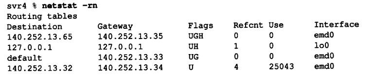
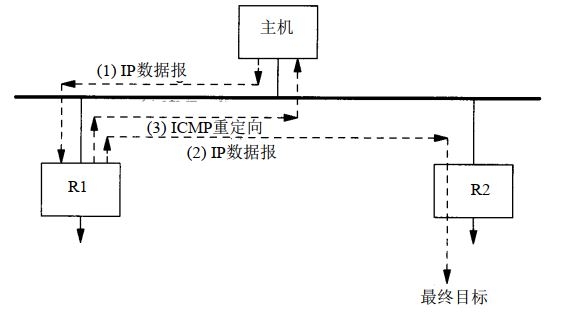

## 静态IP选路
选路是IP最重要的功能之一，它决定了数据报在网络中传输的路径。其主要实现基于路由表，通过指令`netstat -r`可以显示路由表，如下图所示：

第1行说明，如果目的地是 140.252.13.65（slip主机），那么网关（路由器）将把分组转
发给140.252.13.35（bsdi）。对于给定的路由器，有以下五种标志（flag）：  
- U  该路由可用
- G  该路由是到一个网关（路由器）。如果没有，表示目的地址直连
- H  该路由是到一个主机，目的地址是一个完整的主机地址。如果没有，表示路由到一个网络，目的地址是一个网络地址（主机号部分为 0）
- D  表明该路由是为重定向报文创建的
- M   表明该路由已经被重定向报文修改

因此，IP选路的步骤如下：  
1. 搜索匹配的主机地址，也就是用IP地址匹配那些带H标志的目标主机地址；
2. 若1失败（未查询到目标主机IP地址），就搜索匹配的网络地址；
3. 若2失败，搜索默认表项，也就是发送到默认网关。

如果路由表中未匹配到任何表项，如果数据报由主机产生，就会返回一个“主机不可达差错”或“网络不可达差错”；如果是被转发的数据报，就会给原始发送端返回一个ICMP主机不可达的差错报文。

## ICMP重定向差错
当IP数据报应该被发送到另一个路由器	R2时，收到数据报的路由器R1就要发送 ICMP重定向差
错报文给IP数据报的发送端。

  

工作过程如下：
1. 若R1是主机的默认路由，则主机可能将数据报发送至R1；
2. R12接收到数据报并查询路由表，发现R2是下一跳。当把数据报转发至R2时，R1发现即将要发送的接口与数据报到达的接口相同（也就是主机和两个路由器在一个局域网）。此时，会导致重定向；
3. R1发送一个ICMP重定向报文给主机，告知以后把数据报直接发给R2，主机也会在路由表中做相应的改动。

